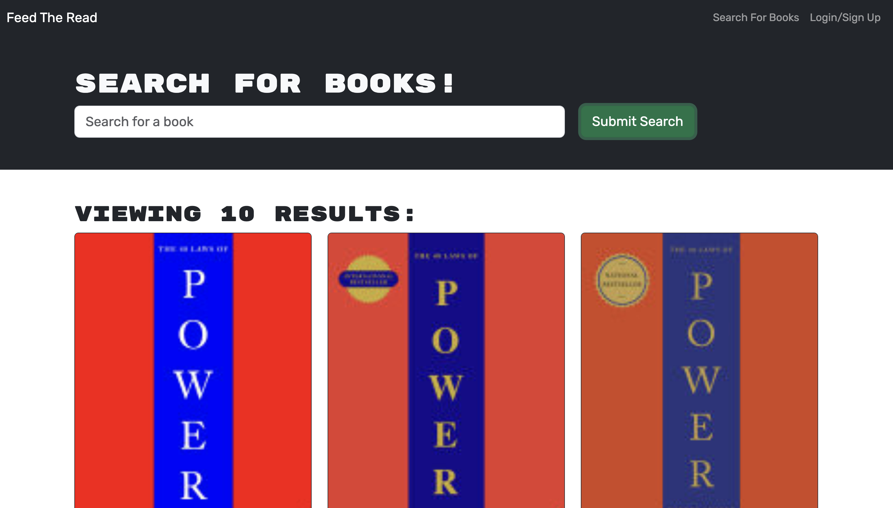

## <a name="top"></a>

# Feed the Read

**Nourishing Your Literary Curiosity...**

[Link to deployed website...]()

---


## Description

**Feed the Read** is a powerful book search engine designed to nourish the literary curiosity of avid readers. Originally built using a RESTful API, this project has been refactored to leverage the capabilities of a GraphQL API powered by Apollo Server, providing a more flexible and efficient querying experience. The application enables users to search for books using the Google Books API and offers a seamless way to create personal reading lists by saving books to their profile.

By using the Apollo Server with GraphQL, Feed the Read optimizes data fetching and provides a robust, modern interface for book lovers to explore and organize their reading adventures.



---

## Table of Contents

- [Features](#features)
- [Technologies Used](#technologies-used)
- [Installation](#installation)
- [GraphQL Queries and Mutations](#graphql-queries-and-mutations)
- [Usage](#usage)
- [Contributing](#contributing)
- [Tests](#tests)
- [Questions](#questions)
- [License](#license)

---

## Features

With an intuitive user interface and a clean design, Feed the Read allows users to:

- Search for books by title, author, or keywords.
- View detailed information about each book, including title, author, description, cover image, and a link to the book on the Google Books site.
- Create an account or log in to save books to a personalized reading list.
- Manage a list of saved books by adding or removing entries.
- Keep track of books to read in the future and revisit favorite reads.

---

## Technologies Used

- **MERN Stack**: MongoDB, Express.js, React, Node.js
- **GraphQL**: Apollo Server for managing GraphQL queries and mutations.
- **Google Books API**: For retrieving detailed book data.
- **MongoDB Atlas**: Cloud database for storing user data and saved books.
- **Render**: For application deployment.

---

## Installation

**To install this project locally, jump into your terminal application and please follow these steps**:

1. **Clone the `Feed-The-Read` repository**:

   ```bash
   Using HTTPS:
   git clone https://github.com/TEMPTAG/Feed-The-Read.git

   Using SSH:
   git clone git@github.com:TEMPTAG/Feed-The-Read.git

   Using GitHub CLI:
   gh repo clone TEMPTAG/Feed-The-Read
   ```

2. **Navigate into the `Feed-The-Read` directory you just cloned down**:

   ```bash
   cd Feed-The-Read
   ```

3. **Install the npm dependencies**:

   ```bash
   npm install
   ```

4. **Create an `.env` file in the root directory and add the following**:

   ```bash
    MONGODB_URI=your_mongo_db_uri
    JWT_SECRET_KEY=your_secret_key
   ```

5. **Seed the Database**:

   ```bash
   npm run seed
   ```

6. **Start the appropriate server**:

   - Development server with live (nodemon) reloading:

   ```bash
   npm run dev
   ```

   - Production server:

   ```bash
   npm start
   ```

---

## GraphQL Queries and Mutations

All GraphQL queries and mutations can be made at the following endpoint after starting the server:

http://localhost:3001/graphql

Use this endpoint to execute GraphQL queries and mutations, such as retrieving user data or managing saved books.

**GraphQL Queries**

- `me`
  - Description: Retrieves the logged-in user’s data, including saved books.
  - Returns: A User object containing:
    - \_id
    - username
    - email
    - bookCount
    - savedBooks (Array of Book type)

**GraphQL Mutations**

- `login(email: String!, password: String!)`
  - Description: Logs in a user.
  - Parameters:
    - email: User’s email address.
    - password: User’s password.
  - Returns: An Auth object containing:
    - token
    - user (User type)
- `addUser(username: String!, email: String!, password: String!)`
  - Description: Creates a new user account.
  - Parameters:
    - username: Desired username.
    - email: User’s email address.
    - password: User’s password.
    - Returns: An Auth object.
- `saveBook(input: BookInput!)`
  - Description: Saves a book to the user’s profile.
  - Parameters:
    - input: An input type object containing the following fields:
    - bookId: The unique ID for the book.
    - authors: An array of author names.
    - description: A short summary of the book.
    - title: The book’s title.
    - image: A URL to the book’s cover image.
    - link: A URL to the book’s page on Google Books.
  - Returns: The updated User object.
- `removeBook(bookId: String!)`
  - Description: Removes a book from the user’s saved list.
  - Parameters:
    - bookId: The unique ID for the book.
  - Returns: The updated User object.

**Example Query**

```graphql
{
  me {
    _id
    username
    email
    savedBooks {
      bookId
      title
      authors
      description
    }
  }
}
```

**Example Mutation**

```graphql
mutation {
  login(email: "example@example.com", password: "password123") {
    token
    user {
      username
      email
    }
  }
}
```

---

## Usage

- **Search for Books**: Enter a search term and browse through the results.
- **Login/Signup**: Create a new account or log in to save books.
- **Save Books**: Click on the “Save This Book” button to add a book to your reading list.
- **View Saved Books**: Navigate to the “Saved Books” section to manage your list.
- **Remove Books**: Click the “Remove” button to delete a book from your saved list.

---

## Contributing

 

OH. MY. GOODNESS. Collaborations are amazing. Share ideas, code, etc. with others is the best way to share knowledge, mutual enthusiasms, and a lot of times we make cool friends along the way. I welcome contributions in many ways, shapes, and forms:

- [Email Me](mailto:iansterlingferguson@gmail.com) and just plain tell me what you like, do not like, would like to see changed... just give me a compliment before laying it on me
- FORK IT ALL - create a fork, clone it down, mess it up, do the neato commits and comments, push it back, test it at least a million times, then submit a pull request for me to review and merge into the project if I think you are cool (and the code is cool too) - but again, the nice thing to do would be emailing me first and telling me your intentions... and don't forget the compliment part

Something, something... Have your people call my people. And by call, I mean email - who answers the phone these days?

---

## Tests

As the above states, please test your changes thoroughly before submitting a pull request or sending it straight to me. As far as tests I have done? None. Zero. Ziltch. I have not learned how to do that yet, so I am relying on you to do your part until I learn how to do mine.

In the future, I plan to add testing for both frontend and backend. Keep an eye out for updates here!

---

## Questions

Have questions about this project? Want to collaborate? Eager to discuss conspiracy theories or debate why your favorite car is not as cool as you think? [Email Me](mailto:iansterlingferguson@gmail.com) — just do not call, because I probably will not answer.

Did this project make your life better in any way, shape, or form? Check out my other exceptionally rare moments of lucidity on my [GitHub Profile](https://github.com/TEMPTAG)

---

## License

This project is covered under the MIT License. The details of the MIT License can be found on their site [HERE](https://opensource.org/licenses/MIT). You can also see the full details of the [LICENSE](./LICENSE) for this specific project in the linked file.

<div align="center">
<em>Copyright © 2024 Ian Ferguson - powered by caffine, love, and a little bit of fun</em>

[Back to top](#top)

</div>
